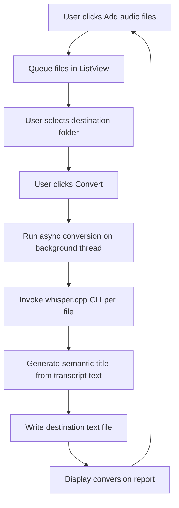
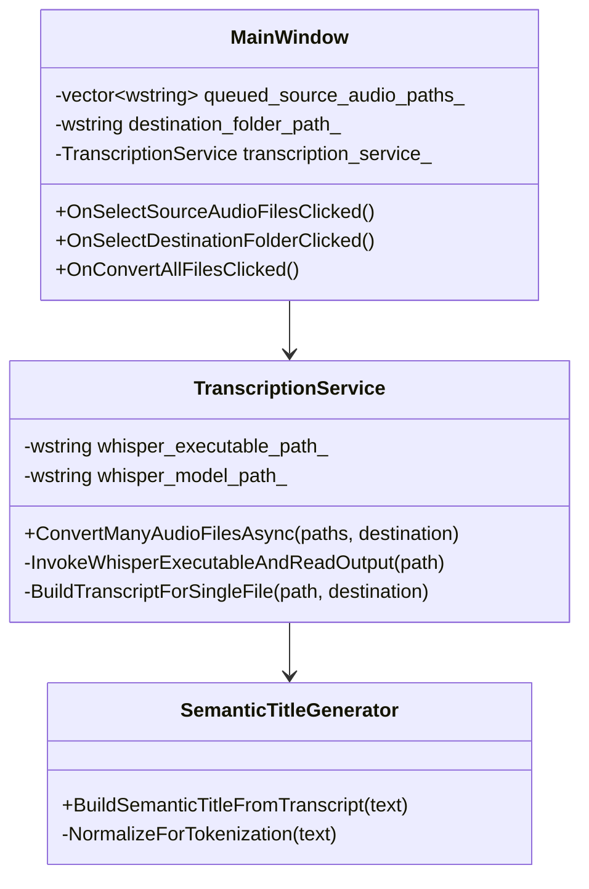

# WinUiWhisperTranscriber

A Windows App SDK (WinUI 3 + C++/WinRT) desktop app for local speech-to-text batch conversion.

## What it does

- Lets users add multiple audio files repeatedly (queue-style loop).
- Lets users select an output destination folder.
- Converts queued audio files asynchronously through `whisper.cpp` CLI.
- Produces `.txt` files named with the original filename plus a semantic title.
- Shows a conversion report listing source, destination, and generated title.

## Build notes

- Target platform: Windows 11/10.
- Recommended IDE: Visual Studio 2022 with **Windows App SDK** and **C++/WinRT** workloads.
- This repository includes `CMakeLists.txt` for project orchestration, but WinUI 3 requires Windows-specific toolchain integration.

## Runtime dependency

Configure paths in `MainWindow.xaml.cpp` constructor:

- `whisper_executable_path`: path to `main.exe` from `whisper.cpp`.
- `whisper_model_path`: model file such as `ggml-base.en.bin`.

## High-level flow

## Class diagram

