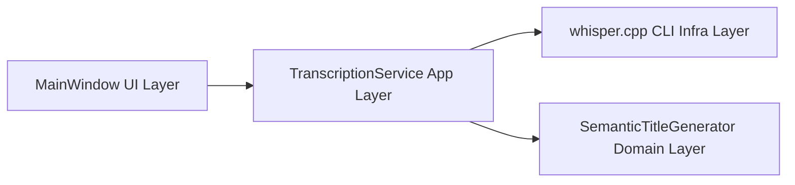
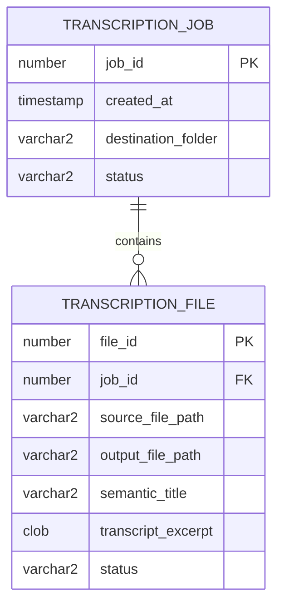

# Requirements: WinUI 3 Local Batch Audio Transcriber

## Functional requirements

1. App must allow users to select multiple source audio files in one action.
2. App must allow users to add more files after prior selections (looping queue model).
3. App must allow users to choose one destination folder for output text files.
4. App must provide a `Convert` action that processes all queued files asynchronously.
5. App must transcribe locally via `whisper.cpp` (no cloud dependency).
6. Output file naming convention must include:
   - Original source file stem.
   - Semantic title inferred from transcript content.
7. App must show a conversion report with per-file source path, output path, semantic title.
8. App must keep running after conversion so user can repeat the process.

## Non-functional requirements

1. Privacy: transcription must be local-only.
2. Responsiveness: UI thread must remain responsive during conversion.
3. Fault tolerance: one conversion failure must be reported with actionable message.
4. Maintainability: C++23, clear naming, modular services.

## Architecture DSD (Design Structure Diagram)

## Optional persistence model (Oracle-ready ERD)

